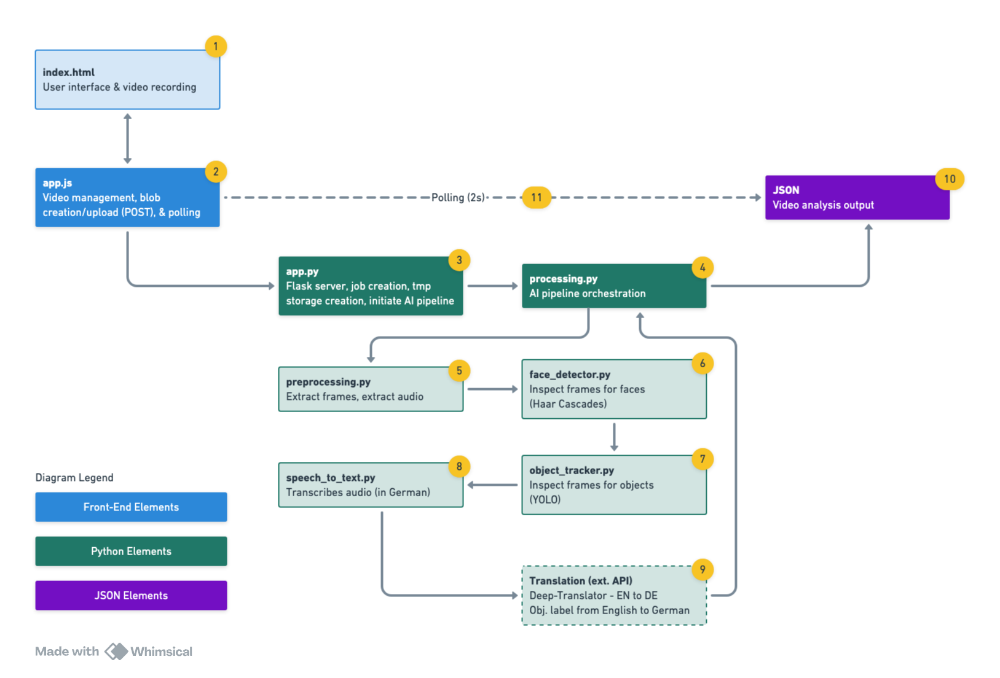
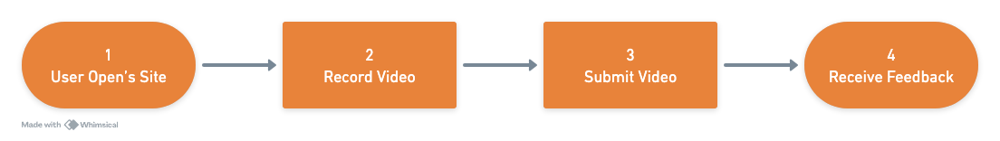

# Sprech&Scene
**AI-Powered Object Learning Application**

> A German language learning tool that combines computer vision, speech recognition, and translation to help users practice object identification and pronunciation.


## Project Overview

**Sprech&Scene** (German: "Sprechen" = to speak, "Sehen" = to see) is an interactive web application designed to help users learn German vocabulary through AI-powered object recognition and speech analysis. Users record short videos of themselves naming objects in German, and the application provides real-time feedback on pronunciation accuracy and object identification.

This project was developed as a final assignment for **CIS-360 "AI with Deep Learning"** at Northwestern University (Spring 2025), demonstrating practical applications of computer vision, natural language processing, and web development technologies.

## Features

- **Real-time Video Recording**: Browser-based video capture with live camera preview
- **Multi-Modal AI Analysis**:
  - Face detection using OpenCV Haar Cascades
  - Object detection and tracking with YOLOv8
  - German speech recognition via OpenAI Whisper
  - English-German translation using deep-translator
- **Instant Feedback**: Accuracy assessment comparing spoken German with detected objects
- **Multiple Recording Sessions**: Start new recordings without page refresh
- **Modern UI**: Responsive glass-morphism design with Bootstrap integration

## Architecture & Flow

### System Flow
__Application Architecture__
```

```
__User Process Flow__
```

```

### AI Processing Pipeline
1. **Video Preprocessing**: Frame extraction (1 FPS) and audio extraction (WAV)
2. **Face Detection**: OpenCV Haar Cascade classifiers identify faces
3. **Object Detection**: YOLOv8 detects and tracks objects with IoU-based tracking
4. **Speech Recognition**: Whisper transcribes German audio
5. **Translation**: Deep-translator converts English object labels to German
6. **Validation**: Semantic matching between transcription and translated labels

## File Structure

```
Project/
├── app/
│   ├── app.py              # Flask web server and API endpoints
│   └── processing.py       # AI pipeline orchestrator
├── models/
│   ├── face_detector.py    # OpenCV Haar Cascade face detection
│   ├── object_tracker.py   # YOLOv8 object detection and tracking
│   └── speech_to_text.py   # OpenAI Whisper speech recognition
├── preprocess/
│   └── preprocess.py       # Video frame and audio extraction
├── static/
│   ├── app.js             # Frontend JavaScript logic
│   └── style.css          # Modern UI styling
├── templates/
│   └── index.html         # Main application interface
├── tmp/                   # Temporary processing files (auto-generated)
│   ├── uploads/          # Uploaded video files
│   ├── frames/           # Extracted video frames
│   ├── audio/            # Extracted audio files
│   └── results/          # Processing results (JSON)
├── requirements.txt       # Python dependencies
└── README.md             # This file
```

## Quick Start

### Prerequisites
- Python 3.8+ (Developed on Python 3.12)
- Modern web browser with camera/microphone access
- ffmpeg (for audio processing)

### Installation

#### Development Setup
```bash
# Clone the repository
git clone https://github.com/abisogni/NWCIS360-final.git
cd NWCIS360-final

# Create virtual environment
python -m venv venv
source venv/bin/activate  # On Windows: venv\Scripts\activate

# Install dependencies
pip install -r requirements.txt

# Run the application
python app/app.py
```

#### Direct Installation
```bash
# Install dependencies directly
pip install flask>=2.0.0 opencv-python>=4.5.0 ultralytics>=8.0.0 ffmpeg-python>=0.2.0 openai-whisper>=20240930 deep-translator>=1.9.0

# Clone and run
git clone https://github.com/abisogni/NWCIS360-final.git
cd NWCIS360-final
python app/app.py
```

### Usage
1. Open your browser to `http://127.0.0.1:5000`
2. Allow camera and microphone permissions
3. Hold an object visible to the camera
4. Click "Start Recording" and speak the German name of the object
5. Click "Stop & Analyze" to submit for processing
6. View results showing transcription, detected object, and accuracy assessment
7. Click "Start New Recording" for additional attempts

## Technical Details

### Dependencies
| Package | Purpose | Installation Note |
|---------|---------|-------------------|
| Flask | Web framework | Use pip (conda version may be outdated) |
| OpenCV | Computer vision | `opencv-python` via pip recommended |
| Ultralytics | YOLOv8 object detection | pip only |
| Whisper | Speech recognition | `openai-whisper` via pip |
| deep-translator | Translation service | pip only |
| ffmpeg-python | Audio processing | Requires system ffmpeg installation |

### System Requirements
- **Developed on**: macOS 14.6.1 (M1 chip)
- **IDE**: PyCharm 2024.2.2 Professional
- **Tested browsers**: Arc, Safari, Chrome
- **Note**: Should work on Windows/Linux, but primary testing was on macOS

### Configuration
- **Frame extraction**: 1 frame per second (optimized for speed vs. accuracy)
- **Audio format**: 16kHz mono WAV files
- **YOLO confidence**: 0.25 (lowered from default 0.5 for better detection)
- **Whisper model**: "base" (balance of speed and German accuracy)
- **Polling interval**: 2-second intervals for result checking

## Known Limitations

### Object Detection Challenges
- **Reflective surfaces**: Silverware and glass objects may fail detection due to lighting
- **Limited object classes**: YOLOv8 only recognizes 80 predefined object categories
- **Positioning sensitivity**: Objects must be prominently displayed and well-lit
- **Background interference**: Remove other recognizable objects from frame

### Performance Considerations
- **Processing time**: 10-30 seconds per video depending on length
- **Internet dependency**: Translation requires internet connection
- **Model loading**: Initial startup may take 30-60 seconds to load AI models

### Recommended Testing Objects
**Best performance with**: bottle, cup, apple, banana, keyboard, knife, fork, spoon, cell phone, book

**Avoid**: Highly reflective items, transparent glass, objects not in YOLO training set

## Usage Tips

1. **Lighting**: Use even, non-reflective lighting
2. **Object placement**: Hold objects prominently in center of frame
3. **Speaking**: Speak clearly in German with 2-3 second recordings
4. **Object selection**: Choose items from the YOLO object classes (see Appendix)
5. **Background**: Use clean, uncluttered backgrounds

## Development Notes

### API Endpoints
- `GET /` - Main application interface
- `POST /upload` - Video upload and processing trigger
- `GET /result/<job_id>` - Polling endpoint for processing results

### Data Flow
1. Frontend captures video blob via MediaRecorder API
2. Flask receives upload, generates unique job ID
3. Processing pipeline extracts frames/audio and runs AI models
4. Results stored as JSON file linked to job ID
5. Frontend polls for completion and displays results

## Performance Metrics

- **Frame extraction**: 1 FPS (3-6 frames per typical recording)
- **Face detection**: ~100ms per frame
- **Object detection**: ~200ms per frame  
- **Speech transcription**: ~2-5 seconds per audio file
- **Translation**: ~500ms per request

## Future Improvements

### Suggested Enhancements
1. **Advanced Object Detection**: Migrate to transformer-based models (DETR, Grounding DINO)
2. **Semantic Similarity**: Implement cross-lingual embeddings for fuzzy matching
3. **Offline Translation**: Use HuggingFace models (Helsinki-NLP/opus-mt-en-de)
4. **Grammar Integration**: Add German articles (der/die/das) and case handling
5. **Canvas Visualization**: Display bounding boxes on processed video frames

### Scalability Improvements
- Asynchronous processing with WebSocket updates
- Database storage for user progress tracking
- Multi-language support beyond German
- Mobile app development

## Appendix: Supported Objects

### YOLOv8 Object Classes (80 total)
<details>
<summary>Click to expand full list</summary>

**People & Animals:**
person, bird, cat, dog, horse, sheep, cow, elephant, bear, zebra, giraffe

**Transportation:**
bicycle, car, motorcycle, airplane, bus, train, truck, boat, traffic light, fire hydrant, stop sign, parking meter

**Furniture & Household:**
bench, chair, couch, potted plant, bed, dining table, toilet, tv, laptop, mouse, remote, keyboard, cell phone, book, clock, vase

**Sports & Recreation:**
frisbee, skis, snowboard, sports ball, kite, baseball bat, baseball glove, skateboard, surfboard, tennis racket

**Food & Kitchen:**
bottle, wine glass, cup, fork, knife, spoon, bowl, banana, apple, sandwich, orange, broccoli, carrot, hot dog, pizza, donut, cake

**Electronics & Appliances:**
microwave, oven, toaster, sink, refrigerator

**Personal Items:**
backpack, umbrella, handbag, tie, suitcase, scissors, teddy bear, hair drier, toothbrush

</details>

## License

This project is developed for educational purposes as part of coursework at Northwestern University. Please respect academic integrity guidelines when referencing or building upon this work.

## Creator Details

**Project Creator**: Alex Bisogni  
**Course**: CIS-360 AI with Deep Learning, Northwestern University  
**Repository**: https://github.com/abisogni/NWCIS360-final.git

---

*Sprech&Scene - Where I have yet to conjure up a snappy tagline!
